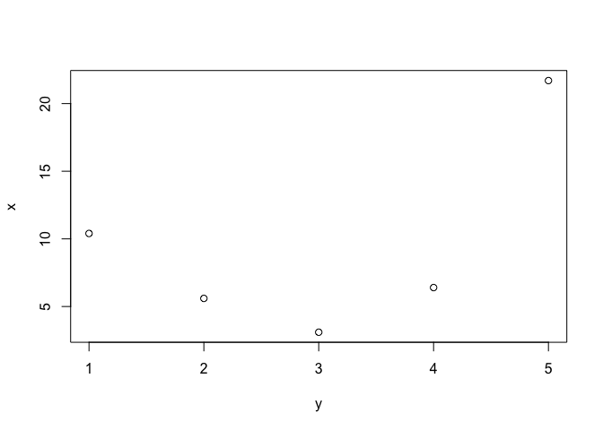

Basic R for BIOL 195000-02
================
Morgan Sparks
4/1/2019

Setting your working directory
------------------------------

The first part of setting up any R script is setting your working directory. Your working directory is functionally a folder (you should make one now on your desktop or wherever you like to store files) where you save R files or access data. There are a couple built in ways to do this, but my preference and generally the way you see it done is a first line of code specifying the filepath to your working directory.

Working Directories often change depending on what you are working on. For instance, you could make a "WD" now that could be for the entire course or it could be for each unit in course. It would probably be best to just set a folder that will be your working directory for the course.

My working directory for the course looks like this (mine is commented out--this is explained in length later in the document--because I just want to show you an example):

``` r
# setwd("~/Dropbox/PhD Work/TA Items/DiseaseLab_Spring 2019/")
```

The pathway you see there starts in my Dropbox Folder (an aside -&gt; work off the cloud, don't lose your files!!!) -&gt; then a file called "PhD Work" -&gt; then "TA Items" -&gt; ...so on... -&gt; then all the way down to the actual directory

Now set your own

``` r
#for Mac users it looks like

setwd("~/")

#for PCs it looks like

setwd(":C/")
```

Loading and installing packages
-------------------------------

The next step you will do in your work is to install and load packages. There are many ways to do this but I reccomend using a command line to install packages (you can also do so in the sidebar with the Packages tab and the Install button)

Packages will only need to be installed once (unless you update your R or Rstudio).

To do so use the command:

``` r
install.packages("")
```

Install a package
-----------------

Now let's install the package `ggplot2` and \`Rmisc, packages we will use in the next exercise.

``` r
install.packages("ggplot2")
install.packages("Rmisc")
```

Loading packages
----------------

You will often need to use multiple packages when working in R. By loading a package, you are loading a set of commands and functions that are accessible only when that package is loaded. For example, ggplot uses the `ggplot()` function to make figures, but R will not do so if you haven't loaded the ggplot package. You load packages using a command called `library()`

Let's now load ggplot.

``` r
library(ggplot2)
```

Now you're ready to plot with ggplot

Now let's learn some introductory R
-----------------------------------

Just for reference I am going to copy some of what [*An Introduction to R*](https://cran.r-project.org/doc/manuals/r-release/R-intro.pdf) uses.

> "R operates on named data structures. The simplest such structure is the numeric vector, which is a single entity consisting of an ordered collection of numbers. To set up a vector named `x`, say, consisting of five numbers, namely 10.4, 5.6, 3.1, 6.4 and 21.7, use the R command: "

``` r
x <- c(10.4, 5.6, 3.1, 6.4, 21.7)

#print x to see it in your console
x
```

    ## [1] 10.4  5.6  3.1  6.4 21.7

You can now use this vector for arithmetic or even functions. Here we will multiply each element of the vectory by 2

``` r
2*x
```

    ## [1] 20.8 11.2  6.2 12.8 43.4

If we make another vector, `y`, we can plot x as a function of `y` assuming the vectors are the same length

``` r
y <-c(1,2,3,4,5)

plot(x~y)
```



A quick note about naming objects in R
--------------------------------------

It's best to never use the same names in R. For example:

``` r
#set the variable z to equal 10
z <- 10

#if you were to change it to 15

z <- 15

#you have reset the variable so that it no longer is = to 10, but now 15.
```

You can make longer, more explanatory names by using periods or underscores for spaces. For instanc `a_long_name`. If you do use spaces, R will give you an error.

Commenting (briefly)
--------------------

It's often useful to put comments in your code to remind you (and other people that will use your code) the purpose of what each part of your work. To comment your code you use `#` symbol. There are a couple of ways to comment code.

``` r
#you can comment above a given line of code like this
plot_base <- plot(x~y)

plot_base_log <- plot(log(x) ~ y) #or you can comment within a line like this
```

Its often useful to do both, like so:

``` r
#code to plot different iterations of vectors x and y with and without transformations

plot_base <- plot(x~y) #plot cars without any transformation

plot_base_log <- plot(log(x) ~ y) #plot cars with a log transformation on x
```

Notice, where you place the `#` matters, so if you place it before the code you want to run it won't work

``` r
#now the code is completely commented out plot_base <- plot(x~y) 
```

This can be useful though if you want to have lot's of potential versions of something but want to only run one

``` r
plot_base <- plot(x~y) 

#plot_base_1 <- plot(log(x) ~ y) 

#plot_base_2 <- plot(x ~ log(y))

#plot_base_3 <- plot(log(x)~log(y))
```

**It is HIGHLY recommended that you comment as much of your work as possible.** It's unbelievable how often you might be working on something, assume you know what you are doing, only to return and have no clue what to do with code you wrote on a previous day. Commenting easily fixes this problem.

Practicing with real data
-------------------------

Now let's do some of the exercises we were doing previously with real data.

We'll use the cars data set that is preloaded into base R. We'll call our data (which is basically a big vector) cars\_data.

The data description from R

> "The data give the speed of cars and the distances taken to stop. Note that the data were recorded in the 1920."

``` r
cars_data <- cars
```

Some tricks that will help you understand more of your about your data are the View() and names() functions included in base R. Let's see how they work now.

``` r
str(cars_data) #shows you the structure of your dataset (i.e. are you columns numeric, factors, etc.)
```

    ## 'data.frame':    50 obs. of  2 variables:
    ##  $ speed: num  4 4 7 7 8 9 10 10 10 11 ...
    ##  $ dist : num  2 10 4 22 16 10 18 26 34 17 ...

``` r
View(cars_data) #view the entire dataframe in a new tab

names(cars_data) #view just the names of the columns of data this is 
```

    ## [1] "speed" "dist"

``` r
# really useful when you're trying to remember which partsof the data 
# to call for functions and plots (i.e. speed~dist)
```

Now that you know how the data are organized and what we're calling the variables, we can plot our data. Let's plot stopping distance as a function of speed.

**One of the most important things you can do with your data is to plot it.** This will give you a sense what your data looks like, if it appears to be normally disributed, and if it might violate other assumptions of the models you might want to apply to it.

``` r
plot(dist~speed, data = cars_data)
```


Notice in the past command, not only did we display what parts of the data we wanted to plot `distance~speed`, but also the the source of the data we were using `data =  cars_data`. Almost all functions will have some sort data input section similar to this encoded within the function. Sometimes you will see people use the `attach()` function, which basically says whatever comes after uses the attached data. Generally, this is ill-advised because you will oftend forget to `detach()` data, which can be quite confusing when using a long script.

Getting help
------------

Often times, R is confusing and figuring out a what you're doing can be a bit of a chore. Luckily, there are some built in functions that will help you learn more about what you are doing. Let's look at how this might apply to the plot function

``` r
# the help() command will bring up the help file for whatever command you 
# are working with. Here you see it with plot
help(plot)

#the same is true with the ? function ?? but will search more of R for your information

?plot

??plot
```

For more information about how these functions work specifically see <https://www.r-project.org/help.html>

Google is your friend
---------------------

If you have a question about R I can almost guarantee you you're not the first to have it. If you are receiving an error notification or something just doesn't seem to be working right, google it. Also, there are devoted message boards that allow you to ask questions like Stack Exchange and Stack Overflow. One word of caution, if you don't do your due diligence researching a questions on these boards (i.e. how do you run a linear regression in R?), you might get a snarky comment that this question has already been asked a million times and that you just need to look through past answers.

Coding can be frustrating, often times I might spend hours trying to make one little fix. Finally, I will give up only to sit down the next day and fix the problem in 5 minutes. If you're running into a wall, don't beat your head against it for hours, do something else to try an reorient your mind. Also, ask other class mates or students, they often have different perspectives that might fix your problem in a way you might have never expected.
