Intro to ggplot2
================
Morgan Sparks
10/9/2018

Intro to ggplot
---------------

We're going to learn the basics of ggplot today, especially as it pertains to graphing GLMs that have one continuous and one categorical variable.

Let's start by getting more familiar with our data. We will be using the Palerm's penguins dataset which is a dataset built into the library `palmerpenguins`.

Also, before we get started, the end all be all for information about ggplot is this site <https://ggplot2.tidyverse.org/reference/index.html>. If your question isn't answered there, I can almost guarantee it is answered somewhere else, ggplot is quickly becoming the default plotting program of R.

One final note I would like to make about ggplot is that one of the major differences between ggplot and base R plotting is how the graphing program interacts with your dataset. Base R is much more flexible at reading in your data, whereas ggplot prefers your data is basically in a format where every datum is a row itself with all the information for independent variables as columns along that row. For instance if you were looking at something like hatch timing and noted 15 individuals hatched on given day, each of those individuals would have to be a specific line for ggplot to incorporate them. A lot of the reshaping of data can be done with the `dplyr` package.

``` r
library(ggplot2); library(palmerpenguins)
```

Now, let's look at our data:

``` r
peng_data <- penguins
str(peng_data)
```

    ## tibble [344 × 8] (S3: tbl_df/tbl/data.frame)
    ##  $ species          : Factor w/ 3 levels "Adelie","Chinstrap",..: 1 1 1 1 1 1 1 1 1 1 ...
    ##  $ island           : Factor w/ 3 levels "Biscoe","Dream",..: 3 3 3 3 3 3 3 3 3 3 ...
    ##  $ bill_length_mm   : num [1:344] 39.1 39.5 40.3 NA 36.7 39.3 38.9 39.2 34.1 42 ...
    ##  $ bill_depth_mm    : num [1:344] 18.7 17.4 18 NA 19.3 20.6 17.8 19.6 18.1 20.2 ...
    ##  $ flipper_length_mm: int [1:344] 181 186 195 NA 193 190 181 195 193 190 ...
    ##  $ body_mass_g      : int [1:344] 3750 3800 3250 NA 3450 3650 3625 4675 3475 4250 ...
    ##  $ sex              : Factor w/ 2 levels "female","male": 2 1 1 NA 1 2 1 2 NA NA ...
    ##  $ year             : int [1:344] 2007 2007 2007 2007 2007 2007 2007 2007 2007 2007 ...

``` r
View(peng_data)
```

Getting started with ggplot
---------------------------

The first step to plotting with ggplot is to assign the dataset and variables you will be working with. This creates a completely blank plot, no x or y axes. But, is ready for us to layer upon with different ggplot commands.

``` r
ggplot(peng_data, aes(x = , y = ))
```


Note that all this does is make a blank plot with our x and y variables specified and scales that ggplot tries to guess based on the range of the data in the dataset.

How to display data in ggplot
-----------------------------

ggplot uses geoms (also known more generally as layers) to specify different ways of displaying datasets. Now there are a number which that have all kinds of purposes, but there are a few you are likely to commonly use. These include things like `geom_point` for points, `geom_bar` for barplots, `geom_histogram` for histograms, `geom_boxplot` for boxplots, etc. You get the point. For a much fuller list of available geoms and their use see <https://ggplot2.tidyverse.org/reference/index.html#section-layer-geoms>.

Let's spend some time looking at our data with different geoms, to get a handle on what our data looks like. Let's think of bill length as our dependent variable in this situation. Let's start with `geom_histogram` to get a sense of the distribution of our data.

``` r
ggplot(peng_data, aes(x = bill_length_mm)) +
  geom_histogram()
```

    ## Warning: Removed 2 rows containing non-finite values (stat_bin).

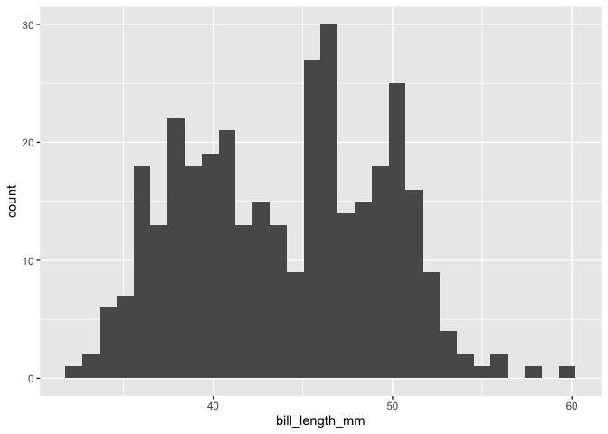

Perhaps we don't like our bin size, we can easily change it with the following code. Binwidth here is based on your data and is up to you to choose. Here we specifify bins for every 0.5 mm.

``` r
ggplot(peng_data, aes(x = bill_length_mm)) +
  geom_histogram(binwidth = 0.5 ) 
```

    ## Warning: Removed 2 rows containing non-finite values (stat_bin).

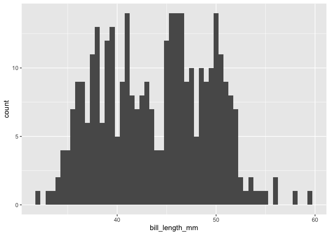

We can also create a smoother density line like we have in class with `geom_density`.

``` r
ggplot(peng_data, aes(x = bill_length_mm)) +
  geom_density()
```

    ## Warning: Removed 2 rows containing non-finite values (stat_density).

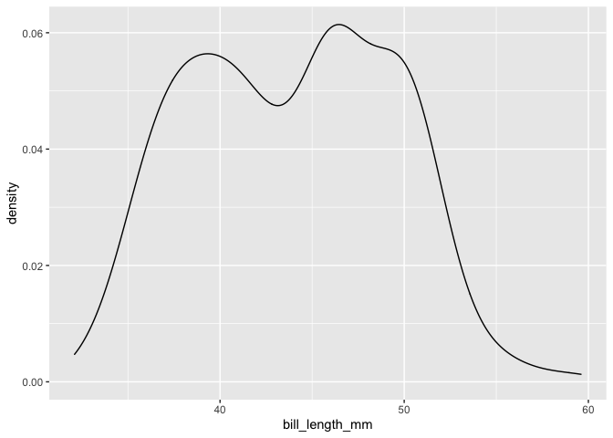

If we look at our histogram and our density plots, it looks like our data might be multimodal. Perhaps it's time to consider our categorical variable. To do this we can create boxplots that give you a sense of the data you are working with. Here it makes sense to look at petal lenght as a function of one of our categorical variables, species.

``` r
ggplot(peng_data, aes(x = species , y =bill_length_mm)) +
  geom_boxplot()
```

    ## Warning: Removed 2 rows containing non-finite values (stat_boxplot).

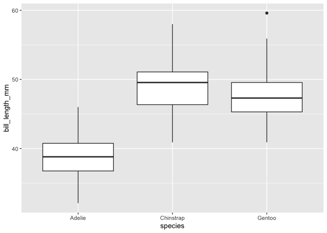

Indeed, it looks like we have different distributions for our species.

Okay, now that we have a good sense of the distribution of our data, let's think more about our modeling appraoch. Let's say for the sake of this exercise, we think that penguins with longer beaks will also have longer flippers.

Because these data are continuous, it makes sense to display them as a scatterplots with `geom_point`.

``` r
ggplot(peng_data, aes(x = flipper_length_mm, y =  bill_length_mm)) +
  geom_point()
```

    ## Warning: Removed 2 rows containing missing values (geom_point).

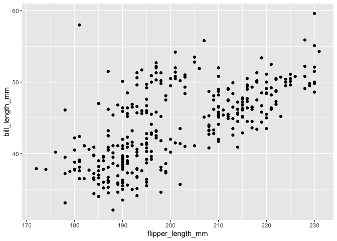

Okay, now it looks like generally there is fairly strong relationship bill and flipper length. Assuming we've gone through all our standard checks testing the assumptions of our GLM and our data looks good, let's add a linear regression to our plot.

We do this by adding another geom (or layer), in this case `geom_smooth` which is the command for adding models to figures in ggplot

``` r
ggplot(peng_data, aes(x = flipper_length_mm, y =  bill_length_mm)) +
  geom_point() +
  geom_smooth(method = "lm") 
```

    ## Warning: Removed 2 rows containing non-finite values (stat_smooth).

    ## Warning: Removed 2 rows containing missing values (geom_point).

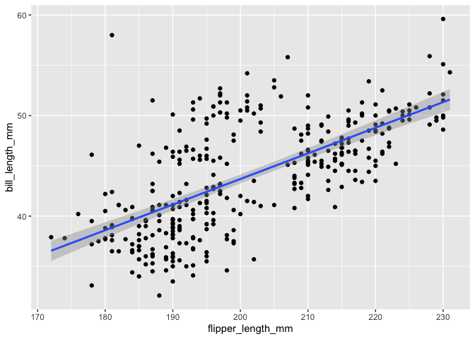

``` r
  # note that method here refers to the type of model we want to use, there are many types available
  # "lm"" here referes to linear model, but we could fit models like gams or loess with other arguments
```

So now we have a linear model fit to our data. But recall our data set. If you use the `names()` you'll see that not only do we have continuous variables for petals and sepals, but we also have the categorical variable of species which we looked at with our boxplot. There are three species present in our data set and perhaps if we considered species in our model it would look different. Let's do that now by using the group designation inside our aesthetic (`aes()`) argument.

``` r
ggplot(peng_data, aes(x = flipper_length_mm, y =  bill_length_mm, group = species)) +
  geom_point() +
  geom_smooth(method = "lm") 
```

    ## Warning: Removed 2 rows containing non-finite values (stat_smooth).

    ## Warning: Removed 2 rows containing missing values (geom_point).

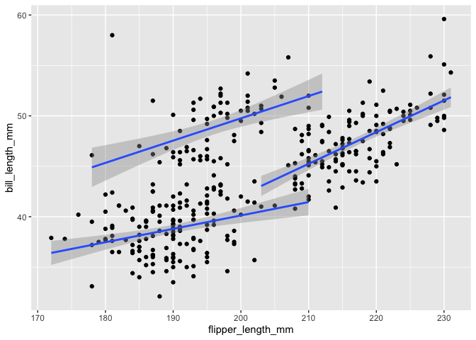

Now we've fit our model with one continuous and one categorical variable, where we consider both continuous and categorical independent variables in our model. Still, though this plot leaves a lot to be desired. Let's make some simple changes to make it more visually appealing.

Let's start by changing the colours to match the species.

``` r
ggplot(peng_data, aes(x = flipper_length_mm, y =  bill_length_mm, group = species, colour = species)) +
  geom_point() +
  geom_smooth(method = "lm") 
```

    ## Warning: Removed 2 rows containing non-finite values (stat_smooth).

    ## Warning: Removed 2 rows containing missing values (geom_point).

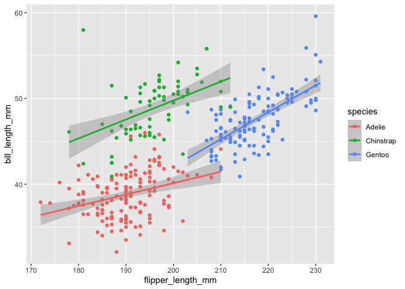

Let's next relable our axes and change axes sizes so our data doesn't extend past our axes labels.

``` r
ggplot(peng_data, aes(x = flipper_length_mm, y =  bill_length_mm, group = species, colour = species)) +
  geom_point() +
  geom_smooth(method = "lm") +
  ylim(30,65) + # here you are setting the y axis limits as 0 (the origin) all the way to 8
  xlim(170,240) + # same as above but for the x axis
  labs(x = "Flipper Length (mm)", y = "Bill Length (mm)")
```

    ## Warning: Removed 2 rows containing non-finite values (stat_smooth).

    ## Warning: Removed 2 rows containing missing values (geom_point).

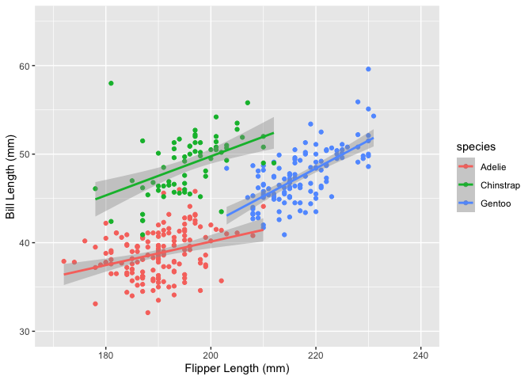

Perhaps we think the points are a little too large and too bold, and want to bring attention just to the line. Let's change point size and opacity, as well as remove the standard error shading on the line.

``` r
ggplot(peng_data, aes(x = flipper_length_mm, y =  bill_length_mm, group = species, colour = species)) +
   geom_point(size = 1.3, alpha = 0.33) + #alpha is how we specify opacity, it is on a scale of 0 (completely see through) to 1 (completely bold, and the default), useful sizes are usually somewhere between 0.75-3, but figure out what looks best for your plot
  geom_smooth(se = FALSE, method = "lm") +
  ylim(30,65) + # here you are setting the y axis limits as 0 (the origin) all the way to 8
  xlim(170,240) + # same as above but for the x axis
  labs(x = "Flipper Length (mm)", y = "Bill Length (mm)")
```

    ## Warning: Removed 2 rows containing non-finite values (stat_smooth).

    ## Warning: Removed 2 rows containing missing values (geom_point).

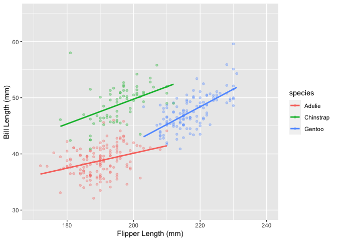

How about we change our colors now, especially given the prevalence of colorblindess (inability to tell reds from greens). The easiest way to do this is with `scale_color_brewer` and to specify the palette of your choice (see palettes <http://www.sthda.com/english/wiki/colors-in-r>). A word of warning, setting colors does and will get complicated quickly. We won't get into the specifics, but just know there a tremendous number of ways and reasons to specify colors in ggplot.

Here we use the `Dark2` palette.

``` r
ggplot(peng_data, aes(x = flipper_length_mm, y =  bill_length_mm, group = species, colour = species)) +
   geom_point(size = 1.3, alpha = 0.33) + 
  geom_smooth(se = FALSE, method = "lm") +
  ylim(30,65) + # here you are setting the y axis limits as 0 (the origin) all the way to 8
  xlim(170,240) + # same as above but for the x axis
  labs(x = "Flipper Length (mm)", y = "Bill Length (mm)") +
  scale_color_brewer(palette = "Dark2" )
```

    ## Warning: Removed 2 rows containing non-finite values (stat_smooth).

    ## Warning: Removed 2 rows containing missing values (geom_point).

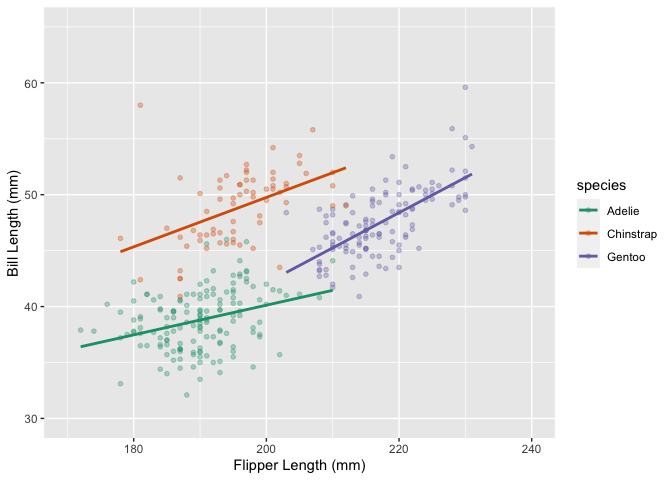

Now, one of the common complaints about base ggplot figures is their background designation. Lot's of people don't like the grey background or the axis lines. Luckily this is an easy change using themes. Again, with ggplot and R in general, there are tons of ways different styles to choose from. My favorite is `theme_classic` as it produces clean figures in a style that most journals like.

``` r
ggplot(peng_data, aes(x = flipper_length_mm, y =  bill_length_mm, group = species, colour = species)) +
   geom_point(size = 1.3, alpha = 0.33) + 
  geom_smooth(se = FALSE, method = "lm") +
  ylim(30,65) + # here you are setting the y axis limits as 0 (the origin) all the way to 8
  xlim(170,240) + # same as above but for the x axis
  labs(x = "Flipper Length (mm)", y = "Bill Length (mm)") +
  scale_color_brewer(palette = "Dark2" ) +
  theme_classic()
```

    ## Warning: Removed 2 rows containing non-finite values (stat_smooth).

    ## Warning: Removed 2 rows containing missing values (geom_point).

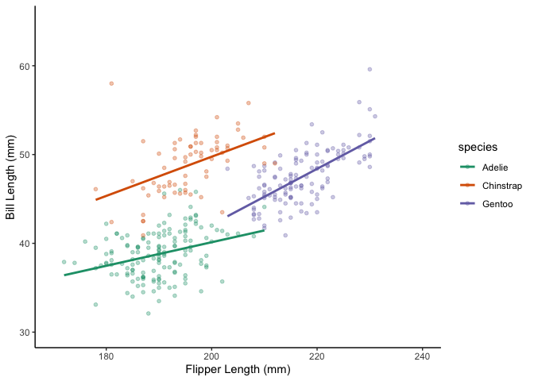

One of the most important things to do once you've created your finished plot is to save it as a file. Journals have all kinds of demands on how to format plots, but one of the most reliable methods is to save as a PDF. You can do so (and save as other file types) with `ggsave()` command. It will save a copy of your figure in the specified filetype and size to your working directory. See it's application below:

``` r
ggplot(peng_data, aes(x = flipper_length_mm, y =  bill_length_mm, group = species, colour = species)) +
   geom_point(size = 1.3, alpha = 0.33) + 
  geom_smooth(se = FALSE, method = "lm") +
  ylim(30,65) + # here you are setting the y axis limits as 0 (the origin) all the way to 8
  xlim(170,240) + # same as above but for the x axis
  labs(x = "Flipper Length (mm)", y = "Bill Length (mm)") +
  scale_color_brewer(palette = "Dark2" ) +
  theme_classic() +
  ggsave("SepalvsPetal.pdf", width = 4.25, height = 5.5, units = "in")
```

Plotting Least squares means
----------------------------

Briefly, we want to show you how to produce the least squares means in a figure that you would obtain with a GLM that has a continuous and a categorical independent variable. To do this we use the following code.

First, we must create our model:

``` r
peng_reg <-  lm(bill_length_mm ~ flipper_length_mm + species, data = peng_data)
```

We then use the `emmeans` package to produce a table of these results. We run the `emmeans()` by telling it what model (peng\_reg) and what categorical variable (species) we are interested in. It will print a data table with the least squares means, as well as other summary information.

``` r
# install.packages("emmeans") install if you haven't done so

library(emmeans)

emmeans(peng_reg, "species")
```

    ##  species   emmean    SE  df lower.CL upper.CL
    ##  Adelie      41.1 0.314 338     40.5     41.8
    ##  Chinstrap   49.9 0.333 338     49.3     50.6
    ##  Gentoo      44.0 0.417 338     43.2     44.8
    ## 
    ## Confidence level used: 0.95

Now we want to plot these values as a point with associated standard errors. But recall how we talked about earlier that ggplot is very specific about the data it will accept. Using `str()` we see that `iris_ls` is in and "emmGrid" object (an object type specific to the emmeans package and not transferable to other pakcages), which is not something ggplot can handle, so we must convert the data into a dataframe, the main ggplot data format.

``` r
# install.packages("emmeans") install if you haven't done so

peng_ls <- emmeans(peng_reg, "species")

str(peng_ls)
```

    ## 'emmGrid' object with variables:
    ##     species = Adelie, Chinstrap, Gentoo

``` r
peng_ls_df <- data.frame(peng_ls) #data.frame() changes the object type to a dataframe

str(peng_ls_df) #best to make sure thay actually worked
```

    ## 'data.frame':    3 obs. of  6 variables:
    ##  $ species : Factor w/ 3 levels "Adelie","Chinstrap",..: 1 2 3
    ##  $ emmean  : num  41.1 49.9 44
    ##  $ SE      : num  0.314 0.333 0.417
    ##  $ df      : num  338 338 338
    ##  $ lower.CL: num  40.5 49.3 43.2
    ##  $ upper.CL: num  41.8 50.6 44.8

Now we can begin plotting the least squared means using the `peng_ls_df` dataframe we just created. Let's start with a simple version of that figure. Notice the syntax change with `geom_errorbar`, this is due to the fact that you need to create a separate set of aesthetics (`aes()`) for your ymin and ymax values.

``` r
ggplot(peng_ls_df, aes(x = species, y = emmean)) +
  geom_point() + 
  geom_errorbar(aes(ymin =emmean - SE, ymax = emmean + SE), peng_ls_df)
```

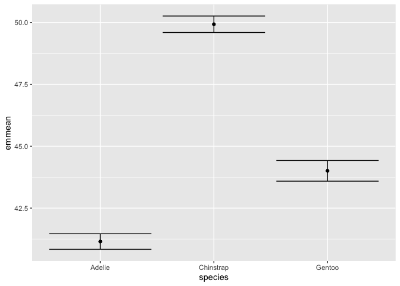

Now let's make this figure a little more presentable using some of the tricks we learned earlier.

``` r
ggplot(peng_ls_df, aes(x = species, y = emmean, colour = species)) +
  geom_point(size = 2) + 
  geom_errorbar(aes(ymin =emmean - SE, ymax = emmean + SE), peng_ls_df, width = 0.1) +
  labs(x = "Species", y = "LSM of bill length (mm)") +
  ylim(35,55) +
  scale_color_brewer(palette = "Dark2") +
  guides(colour=FALSE) + #removes the redundant legend, the legend is being set by the colour = Species we set in the aes().  By telling it that colour = FALSE we're just telling it to ignore creating a guide (i.e., a legend) using our colour designation
  theme_classic(base_size = 14)
```

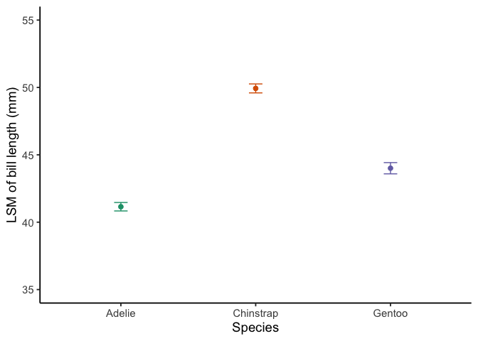

Something that is becoming increasingly popular with some journals is to show summary statisitics along with the raw data. This is a helpful opportunity to show how we can incorporate multiple datasets into one figure. We do this by makaing the exact same plot but adding another geom with its own specific dataset and aes() values.

``` r
ggplot(peng_ls_df, aes(x = species, y = emmean, colour = species)) +
  geom_point(size = 2) + 
  geom_point(aes(x= species, y = bill_length_mm), peng_data, alpha = 0.3, size =1, position = "jitter") +
  geom_errorbar(aes(ymin =emmean - SE, ymax = emmean + SE), peng_ls_df, width = 0.15) +
  labs(x = "Species", y = "LSM of bill length (mm)") +
  ylim(35,55) +
  scale_color_brewer(palette = "Dark2") +
  guides(colour=FALSE) + 
  theme_classic(base_size = 14)
```

    ## Warning: Removed 18 rows containing missing values (geom_point).

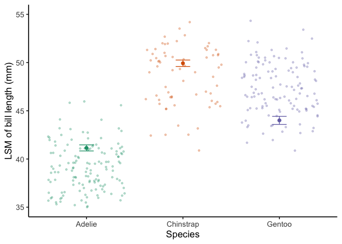

Many journals will charge extra to print in color. There are a couple of ways of doing this, we can remove all colour (as per usual journal requirements), which we will demonstrate here by removing the `colour =` designation in the initial `aes()` setting, as well as all additional colour specifications like the `scale_color_brewer`.

``` r
ggplot(peng_ls_df, aes(x = species, y = emmean)) +
  geom_point(size = 2) + 
  geom_point(aes(x= species, y = bill_length_mm), peng_data, alpha = 0.3, size =1, position = "jitter") +
  geom_errorbar(aes(ymin =emmean - SE, ymax = emmean + SE), peng_ls_df, width = 0.15) +
  labs(x = "Species", y = "LSM of bill length (mm)") +
  ylim(35,55) +
  guides(colour=FALSE) + 
  theme_classic(base_size = 14)
```

Or you can add in shaded plots.

The best way to get around this is by changing the `scale_color_brewer` to `scale_color_grey`. Also note, that the start and end arguments refer to the range of how shaded they are, where 1=white and 0=black. Because we're showing this on a white background, it's best to not go with 1, but a smaller range. You'll probably have to play with the start and end depending on how many levels you have.

``` r
ggplot(peng_ls_df, aes(x = species, y = emmean, colour = species)) +
  geom_point(size = 2) + 
  geom_point(aes(x= species, y = bill_length_mm), peng_data, alpha = 0.3, size =1, position = "jitter") +
  geom_errorbar(aes(ymin =emmean - SE, ymax = emmean + SE), peng_ls_df, width = 0.15) +
  labs(x = "Species", y = "LSM of bill length (mm)") +
  ylim(35,55) +
  scale_color_grey(start=.5, end=0.2) + # see change here
  guides(colour=FALSE) + 
  theme_classic(base_size = 14)
```

    ## Warning: Removed 16 rows containing missing values (geom_point).

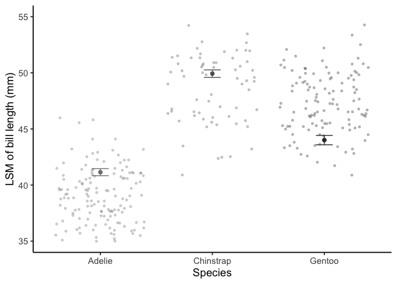

Let's say you didn't like the names of the x-axis labels. You could change them using `scale_x_discrete()`. The reason for this is because we are using discrete (categorical) variables and breaking our data by species using the `colour = Species` command in out aesthetic (`aes()`). But because we're changing the x-scale (read x-axis) we need to use the `scale_x_discrete()` as opposed to the `scale_colour_brewer()`, which only would change the legend labels.

**Note: We recommend using this *general* script for producing figures for this course, as well as journals. Please keep in mind the technique to remove color dispplayed a few examples prior, if color figures are not necessary.**

``` r
ggplot(peng_ls_df, aes(x = species, y = emmean, colour = species)) +
  geom_point(size = 2) + 
  geom_point(aes(x= species, y = bill_length_mm), peng_data, alpha = 0.3, size =1, position = "jitter") +
  geom_errorbar(aes(ymin =emmean - SE, ymax = emmean + SE), peng_ls_df, width = 0.15) +
  labs(x = "Species", y = "LSM of bill length (mm)") +
  ylim(35,55) +
  scale_colour_brewer(palette = "Dark2") +
  scale_x_discrete(breaks = c("Adelie", "Chinstrap", "Gentoo" ), # takes your original labels and says use these to set where we make changes
                   labels = c("Pygoscelis adeliae", "Pygoscelis antarcticus", "Pygoscelis papua" )) + # tells the function what you want to change your labels to
  guides(colour=FALSE) + 
  theme_classic(base_size = 14)
```

    ## Warning: Removed 16 rows containing missing values (geom_point).

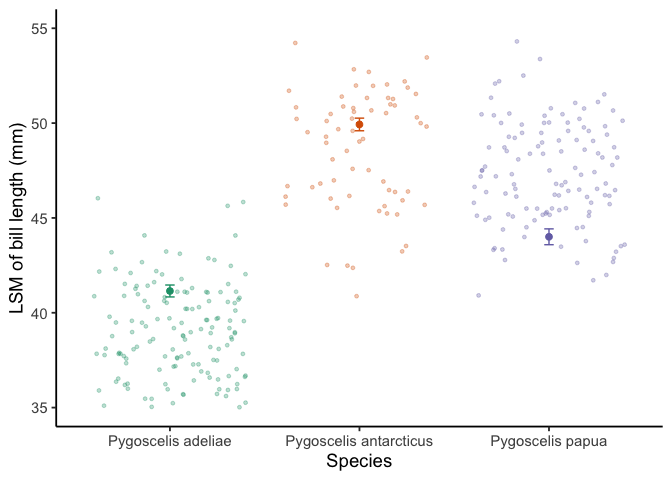

Final thoughts
--------------

This code is a rough framework that you should be able to play around with to create other similar graphs. You could start by changing the x and y variable to see how those relationships are similar and different. Also, I would recommend trying other geoms. Perhaps try and take that boxplot we created early on and make a more visually appealing version. A lot of that basic information for changing plots is on the ggplot website I listed at the start of the exercise.
